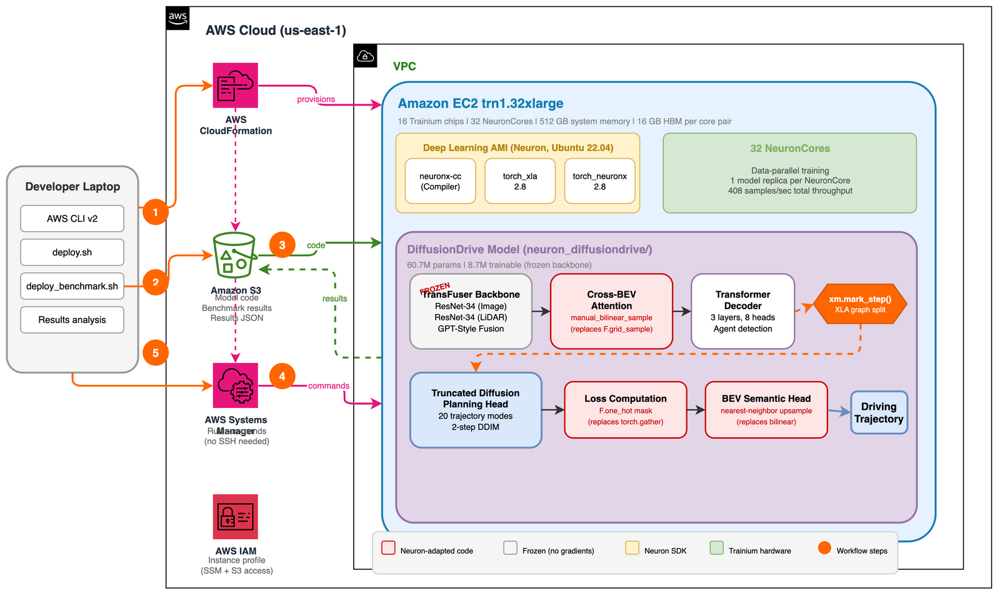

# End-to-End Autonomous Driving on AWS Trainium

Train [DiffusionDrive](https://arxiv.org/abs/2411.15139) (CVPR 2025 Highlight) on [AWS Trainium](https://aws.amazon.com/machine-learning/trainium/) at roughly 2x lower cost than NVIDIA A100 GPU instances, validated on the NAVSIM autonomous driving dataset.

This repository contains the Neuron-adapted model, training and benchmark scripts, and an AWS CloudFormation template. The full adaptation walkthrough lives in [`neuron_diffusiondrive/ADAPTATION_GUIDE.md`](neuron_diffusiondrive/ADAPTATION_GUIDE.md).

## Architecture



The CloudFormation template provisions a `trn1.32xlarge` instance with the Neuron SDK, an Amazon Simple Storage Service (Amazon S3) bucket for artifacts and access logs, and an AWS Identity and Access Management (IAM) role scoped to those buckets. Session Manager, a capability of AWS Systems Manager, is used to run benchmarks without SSH.

## Prerequisites

- AWS account with `trn1.32xlarge` [service quota](https://docs.aws.amazon.com/servicequotas/latest/userguide/intro.html)
- [AWS Command Line Interface (AWS CLI) v2](https://docs.aws.amazon.com/cli/latest/userguide/getting-started-install.html), configured with credentials that can create AWS CloudFormation stacks, Amazon Elastic Compute Cloud (Amazon EC2) instances, IAM roles, and Amazon S3 buckets
- An existing VPC and subnet with outbound internet access
- Python 3.10 or later for local development
- The repository URL where you host this sample (set as `REPO_URL` below)

## Deploy

You are reading this in the source repository. Before deploying, make sure the code is hosted at a Git URL the target Trainium instance can reach (for example, your organization's GitHub or AWS CodeCommit repository). Set `REPO_URL` to that URL.

To discover VPC and subnet IDs suitable for the deployment, run:

```bash
# List VPCs (pick one with internet access)
aws ec2 describe-vpcs \
  --query 'Vpcs[*].[VpcId,CidrBlock,Tags[?Key==`Name`].Value|[0]]' \
  --output table

# List subnets in the chosen VPC (pick one with a route to an internet gateway or NAT)
aws ec2 describe-subnets --filters Name=vpc-id,Values=<your-vpc-id> \
  --query 'Subnets[*].[SubnetId,AvailabilityZone,MapPublicIpOnLaunch]' \
  --output table
```

Set the environment variables, then deploy:

```bash
export REPO_URL="https://github.com/YOUR-ORG/YOUR-REPO.git"
export VPC_ID="vpc-xxxxxxxxx"
export SUBNET_ID="subnet-xxxxxxxxx"

git clone "$REPO_URL" end2end-AI
cd end2end-AI/infra
./deploy.sh deploy
```

Verify the stack reached `CREATE_COMPLETE`:

```bash
aws cloudformation describe-stacks --stack-name diffusiondrive-trainium \
  --query 'Stacks[0].StackStatus' --output text
```

## Run benchmarks

```bash
INSTANCE_ID=$(./deploy.sh status | grep InstanceId | awk '{print $2}')
export S3_BUCKET=$(aws cloudformation describe-stacks --stack-name diffusiondrive-trainium \
  --query 'Stacks[0].Outputs[?OutputKey==`ArtifactBucketName`].OutputValue' \
  --output text)

cd ../neuron_diffusiondrive
./deploy_benchmark.sh $INSTANCE_ID

aws s3 cp s3://$S3_BUCKET/benchmark_results_diffusiondrive.json -
```

## Train on NAVSIM mini

Connect to the Trainium instance using Session Manager, then run the preprocessing and training scripts:

```bash
aws ssm start-session --target $INSTANCE_ID

# On the instance (code is already cloned to /home/ubuntu/end-2end-AI by CloudFormation):
cd /home/ubuntu/end-2end-AI
bash neuron_diffusiondrive/download_and_preprocess.sh
export S3_BUCKET=<artifact-bucket-name>   # same value you exported above
bash neuron_diffusiondrive/run_train_trn1.sh
```

## Clean up

The `trn1.32xlarge` instance is billed by the hour. When you finish your work, delete the stack to stop compute charges. Both the artifact bucket and the access logs bucket use `DeletionPolicy: Retain`, so they survive stack deletion and will continue to incur S3 storage charges until you remove them manually. Download any results you want to keep first.

```bash
# 1. (Optional) Back up results
aws s3 sync s3://$S3_BUCKET ./local_backup/

# 2. Empty the artifact bucket
aws s3 rm s3://$S3_BUCKET --recursive

# 3. Navigate to the infrastructure directory
cd infra

# 4. Delete the stack
./deploy.sh delete

# 5. (Optional) Empty the access logs bucket
LOGS_BUCKET="diffusiondrive-logs-diffusiondrive-trainium-$(aws sts get-caller-identity --query Account --output text)"
aws s3 rm s3://$LOGS_BUCKET --recursive

# 6. Delete the access logs bucket
aws s3api delete-bucket --bucket $LOGS_BUCKET

# 7. Delete the artifact bucket
aws s3api delete-bucket --bucket $S3_BUCKET
```

## Key results

Trained on NAVSIM mini (3,000 training scenes, 615 validation scenes, 13 GB), 50 epochs, stem-only freeze:

| Metric | trn1.32xlarge | p4d.24xlarge (A100) |
|--------|:---:|:---:|
| Training step time | 172.0 ms | 84.2 ms |
| Per-accelerator throughput | 5.82 sps | 11.88 sps |
| Val ADE (m) | 5.85 | 4.45 |
| Cost per 1K samples | $0.032 | $0.064 |
| Relative cost | 1.0x | 2.0x |

See [`neuron_diffusiondrive/ADAPTATION_GUIDE.md`](neuron_diffusiondrive/ADAPTATION_GUIDE.md) for the nine code adaptations required for Neuron compatibility and for detailed benchmark breakdowns.

## Repository layout

```
neuron_diffusiondrive/  # Neuron-adapted model, training, and benchmark code
infra/                  # CloudFormation template and deployment wrapper
docs/                   # Solution architecture diagram (PNG + draw.io source)
```

## License

This adaptation code is provided for research and educational purposes. DiffusionDrive is licensed under [MIT](https://github.com/hustvl/DiffusionDrive/blob/main/LICENSE).
